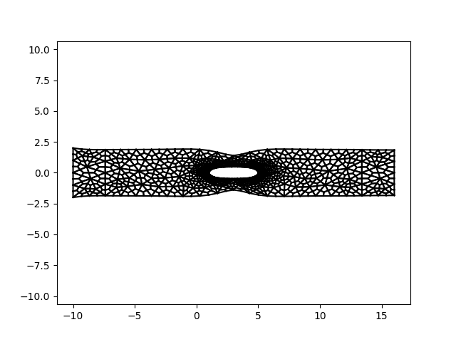

# Hw3 Finite Elements Part 1
## Geometry
 
## Mesh
 
## Element displacement for different meshes
 

 

Al graficar los esfuerzos tuvimos problemas con Gmsh. Creemos que el codigo esta bien al recuperar sigmas y desplazamientos pero que cargarlo a Gmsh se produce un error.

# Hw3 Finite Elements Part 2
## Geometry
 

## Coaerse Mesh

### Mesh:

### Deformation plot with python: 

### Displacements in Gmsh

### Stress in Gmsh

## Medium Mesh:

### Mesh:

### Deformation plot with python: 

### Displacements in Gmsh

### Stress in Gmsh

## Fine Mesh:

### Mesh:

### Deformation plot with python:  

### Displacements in Gmsh

### Stress in Gmsh

## Nodal Stress Averaging:

The first step to accomplish this implementation was to generate a list, containing all the natural nodes.

Once we had this list, we calculate the number of elements in the natural border. If there are n nodes in the border, there will be n-1 elements in the same border. 

As we can see from the geometry, it is always  true that the right bottom node is node number 7, and the right top node is always number 8. Knowing this, we set the load of this nodes as F/(2·Number of elements).

Finally, the loads of all other natural boundary nodes are set with a for:
for n in BordeNatural_nodes:
    if n > 7 :
        f[2*n] = F/Number of elements

### Before Nodal Stress Averaging:

### After Nodal Stress Averaging:

# Hw3 Finite Elements Part 3
## Geometry

## Coaerse Mesh

### Mesh:

### Displacements in Gmsh

### Stress in Gmsh

## Medium Mesh:

### Mesh:

### Displacements in Gmsh

### Stress in Gmsh

## Fine Mesh:

### Mesh:

Advantages of using Quad9 elements is that we can describe the curved sides, while with Quad 4 elements it is not possible. Also, Quad9 elements behave with less stiffness than Quad4 elements, so it is very useful for Finite elements method.
